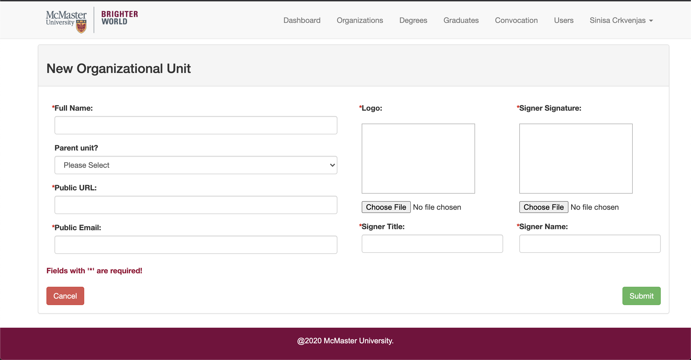
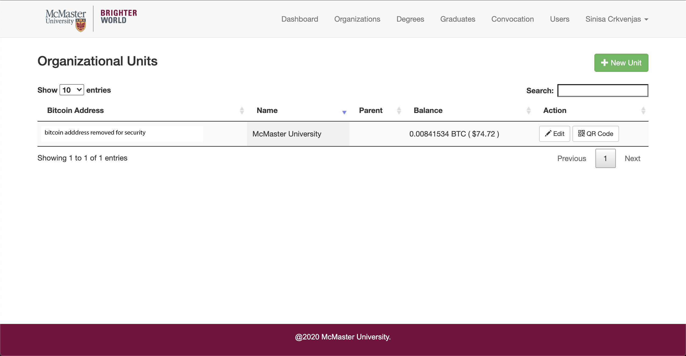
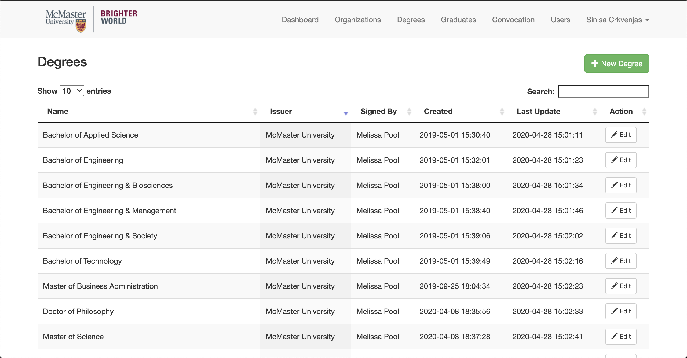
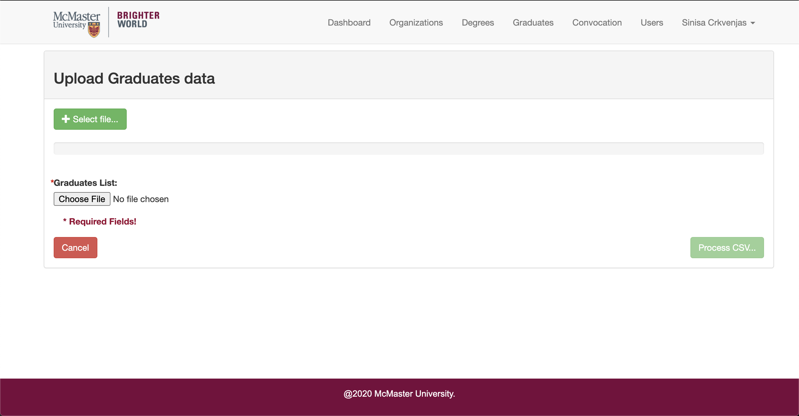
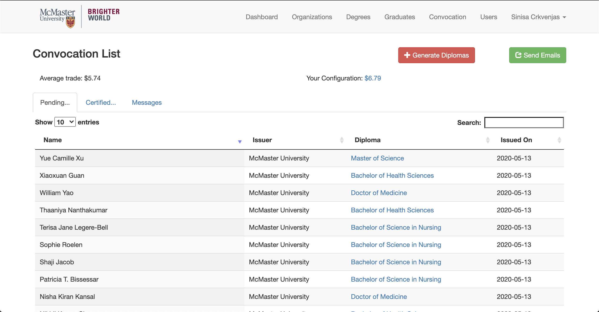
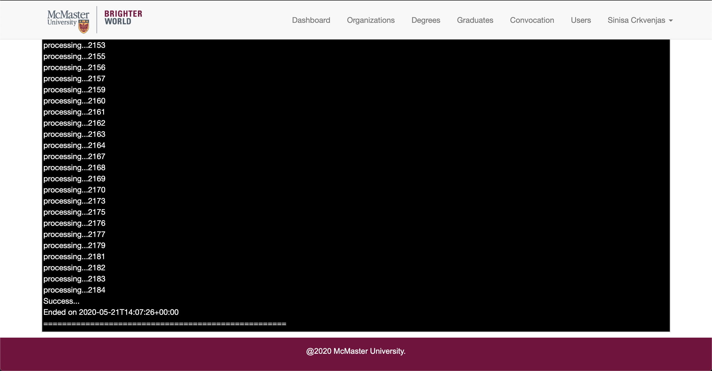
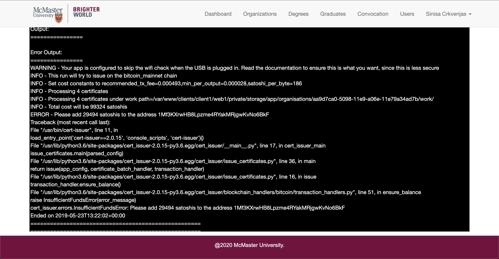
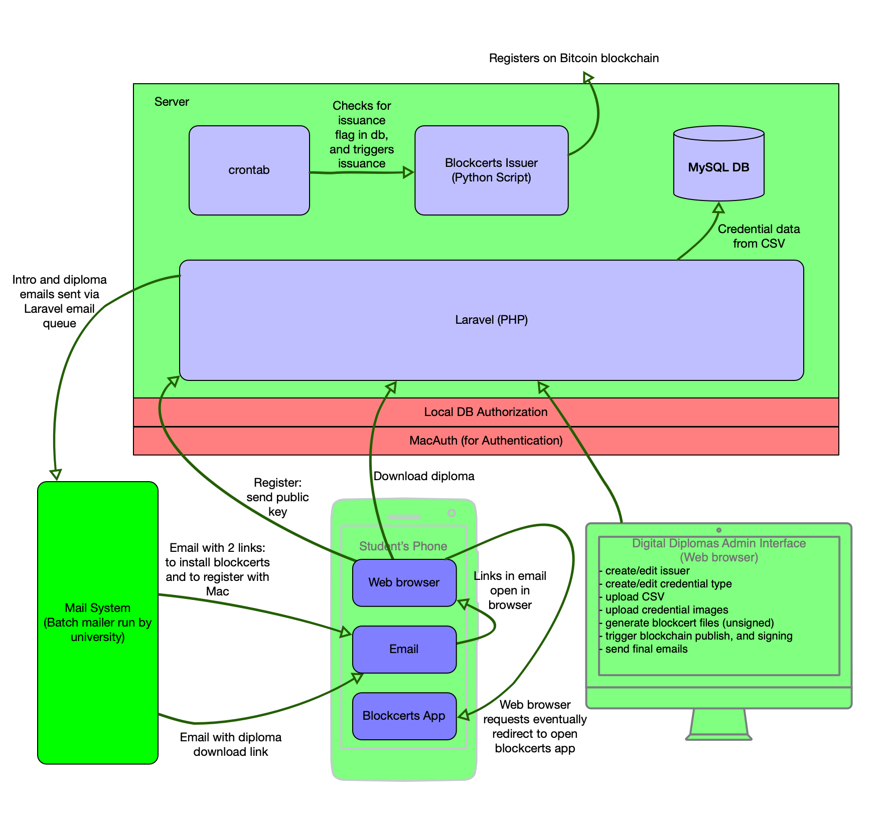

# DigitalDiplomas

A Web based PHP (Laravel) administrative application for managing and issuing McMaster [Blockcerts](https://github.com/blockchain-certificates) credentials using the [Blockcerts Python issuer](https://github.com/blockchain-certificates/cert-issuer)

&nbsp;&nbsp;&nbsp;&nbsp;&nbsp;&nbsp;&nbsp;&nbsp;&nbsp;&nbsp;&nbsp;&nbsp;&nbsp;&nbsp;&nbsp;&nbsp;&nbsp;&nbsp;&nbsp;

[Issuing Credentials](#issuing-credentials)

[Technical Architecture](#technical-architecture)

## Issuing Credentials

The steps to issue a credential:

#### Get a user account on the system

There are two ways to do this:

- the owner of the system (e.g., the Registrar's office) can create an 'organizational unit' on behalf of a new issuer
    SINISA:  is there a separate login (username/password) for each organizational unit?  And are organizational units hidden from each other?
- create an entirely new installation of the system (in a new VM or machine) - McMaster Engineering can help you do this.

#### Login and create a new 'organizational unit'.  An organizational unit can issue different kinds of credentials.  Examples of an organizational unit:

- the Registrar itself
- a department
- a Faculty

- Full Name:  identifies the organizational unit
- Parent Unit:  If specified, the logo image, signer image, signer name, and signer title are copied from parent if not provided for child
- Public URL:  populates field in Blockcert
- Public Email:  populates field in Blockcert
- Logo:  populates field in Blockcert
- Signer Title:  populates field in Blockcert
- Signer Signature:  populates field in Blockcert
- Signer Name: populates field in Blockcert

#### Add Bitcoin

When you create an organizational unit, a Bitcoin address is automatically created.  You will have to add Bitcoin (money) 
to this address to pay for the Bitcoin transaction that will publish the proof (merkle root) of a batch issuance.

Add Bitcoin from the Organizational Unit screen:

You can add money to the bitcoin address using an online service or a bitcoin cash machine.  The QR code for the bitcoin address is also provided as a convenience so you don't have to type in the bitcoin address (which can be error prone) when using a service that supports QR codes.

A single bitcoin transaction is used for an entire batch of credentials, but the cost of a Bitcoin transaction can vary depending on demand.   You'll therefore need to make sure there is enough Bitcoin associated with the Bitcoin address to cover the cost of the transaction at the time of issuance.  The current cost is listed on the Convocation page (where you trigger release of credentials) described further below.

#### Create credential (optional)

An issuer can issue more than one type of credential.  You may create a credential directly in the UI on the Degrees screen (see image below), but
it is better to let the CSV import (described next) automatically create the credential name from the CSV values.  That way the name of the credential in
the database will exactly match the name in the CSV file.

You may also edit existing credentials on the Degrees page:

#### CSV Upload

As you might guess, the CSV upload is the primary way to add credentials, to update them, to release them to students, and to revoke them.  

Upload from the Upload Graduates data screen:

The green '+ Select file...' button is for uploading images (see [Upload Certificate Images](#upload-certificate-images))

The 'Choose File' button under 'Graduates List' is for uploading the CSV.

After selecting the file, click the 'Process CSV' button.

Upload a CSV file that follows this format (same columns in same order):

| ID#       | First Name | Last Name   | Honours | Degree                  | Plan                  | Date       | Distinction | Degree Checkout | Email Address       | Release | Revocation Date | Revocation Comment | Re-Issue | 
|-----------|------------|-------------|---------|-------------------------|-----------------------|------------|-------------|-----------------|---------------------|---------|-----------------|--------------------|----------| 
| 400000081 | Lara       | Santosuosso |         | Doctor of Philosophy    | Biochemistry          | 06/13/2019 |             | Approved        | lsantos@mcmaster.ca | Y       |                 |                    | N        | 
| 400000082 | Nevine     | Chawra      |         | Master of Science       | Medical Sciences      | 06/13/2019 |             | Approved        | chawran@mcmaster.ca | Y       |                 |                    | N        | 
| 400000081 | Lara       | Santosuosso |         | Doctor of Medicine      |                       | 06/13/2019 |             | Approved        | lsantos@mcmaster.ca | Y       |                 |                    | N        | 
| 400000083 | Sarah      | Mooney      | Honours | Bachelor of Arts        | Sociology             | 06/13/2019 |             | Approved        | mooneys@mcmaster.ca | Y       |                 |                    | N        | 
| 400000083 | Sarah      | Mooney      |         | Bachelor of Social Work |                       | 06/13/2019 |             | Approved        | mooneys@mcmaster.ca | Y       |                 |                    | N        | 
| 400000082 | Nevine     | Chawra      |         | Graduate Diploma        | Water Without Borders | 06/13/2019 |             | Approved        | chawran@mcmaster.ca | Y       |                 |                    | N        | 

The order of columns **MUST** be the same as above, and all columns **MUST** appear even if they don't have values.

Blank rows might generate empty credentials, so... don't include empty rows.

Columns:

<dl>
  <dt><strong>ID</strong> (REQUIRED)</dt>  
  <dd>The student number</dd>  
  <dt><strong>First Name</strong> (REQUIRED)</dt>
  <dd>as it should appear in the electronic credential</dd>
  <dt><strong>Last Name</strong> (REQUIRED)</dt>
  <dd>as it should appear in the electronic credential</dd>
  <dt><strong>Honours</strong> (NOT USED)</dt>
  <dd>Here only for compatabiLity with McMaster Registrar's CSV export</dd>
  <dt><strong>Degree</strong> (REQUIRED)</dt>
  <dd>Name of degree as it should appear in the eletronic credential</dd>
  <dt><strong>Plan</strong> (NOT USED)</dt>
  <dd>Here only for compatabiLity with McMaster Registrar's CSV export</dd>
  <dt><strong>Date</strong></dt>
  <dd>Allowed Format: 06/13/2019 This is NOT the date the digital credential was issued. It is the date the credential was officially granted by the Registrar (e.g., Convocation).   This date that will appear on the digital credential as Date of Issuance.</dd>
  <dt><strong>Distinction</strong> (NOT USED)</dt>
  <dd>Here only for compatabiLity with McMaster Registrar's CSV export</dd>
  <dt><strong>Degree Checkout</strong> (REQUIRED) </dt>
  <dd>Allowed Values: APPROVED A row with anything other than 'APPROVED' will be ignored (NOT imported)</dd>
  <dt><strong>Email Address</strong> (REQUIRED)</dt>
  <dd>Used to notify student about electronic diploma</dd>
  <dt><strong>Release</strong> (REQUIRED) </dt>
  <dd>Allowed Values:  Y or N   If 'Y' and student opted-in then record is put in queue for next batch, and so will be listed in the 'Pending' tab of the Convocation List screen.  
  SINISA:  WHAT IF THE RECORD HAS ALREADY BEEN PUBLISHED TO BITCOIN - WILL A VALUE OF Y IN THIS COLUMN THEN JUST BE IGNORED? </dd>
  <dt><strong>Revocation Date</strong> (OPTIONAL)</dt>
  <dd>If there is a date in this field the credential's status will be set to revoked in the database, and the credential will be added to the public revocation list with the given date. The date has to be DD-MM-YYYY</dd>
  <dt><strong>Revocation Reason</strong> (OPTIONAL)</dt>
  <dd>The reason for the revocation.  If present will be published in revocation list.</dd>
  <dt><strong>Re-Issue</strong> (REQUIRED - SINISA:  IS THIS REQUIRED??  - OR IS THAT ONLY A 'Y' REALLY DOES ANYTHING - ANY OTHER VALUE WILL BE IGNORED??) </dt>
  <dd>Allowed Values:  Y or N   If 'Y', then any prior matching diploma for the student will be ignored and a new one issued using the values in this row.  If not 'Y', then any matching diploma will be updated. </dd>
</dl>

##### Actions triggered by CSV

When a CSV is uploaded, each row is read, and an action taken according to the following combinations of values:

###### 'Degree Checkout' is anything except 'Approved'

The row will be skipped (ignored).

###### 'Re-Issue' is 'Y':

Any prior matching diploma for the student will be ignored (where it would otherwise be updated) and a new one issued using the values in this row.

###### 'Revocation Date' has a valid date

Any matching credential - i.e., having the same ID (student number), degree name, and issuance date - is added to the public revocation list with the given date.  The status of the database row will be set to 'revoked'.  NOTE:  THE 'RE-ISSUE' COLUMN SHOULD NOT BE SET TO 'Y' WHEN REVOKING.  RE-ISSUE = Y WOULD CAUSE THE ROW TO BE REVOKED TO BE IGNORED AND INSTEAD A NEW ROW (CREDENTIAL) WOULD BE CREATED AND REVOKED, LEAVING THE OLD RECORD ACTIVE.  NOT LIKELY WHAT WE WANT.

###### Matching Credential exists in DB - same ID (student number), Degree, and Date:

The existing credential is updated with the new row values, UNLESS the Re-Issue column is set to 'Y' in which case matching credentials are ignored, and a new credential is created.
  
###### No Matching Credential in DB

A new credential is created in the database using the values in the row. 
The introductory emaiL is also sent to the student telling them they qualify for a digital diploma and giving them a link to install Blockcerts and a link to opt-in for the diploma.  The opt-in link will open Blockcerts on their phone and send the public key for the student.

###### 'Release' has value 'Y'

If 'Y' and student opted-in then record is put in queue for next batch, and so will be listed in the 'Pending' tab of the Convocation List screen

#### Upload Certificate Images

The McMaster Blockcerts are displayed in the Blockcerts Wallet as a single image that ideally matches the paper copy of the certificate.

Upload a zip file of image files (from the 'Upload Graduates Data' screen).  Each file should be named id_degree.png where the 'id' and 'degree' match the values in the uploaded CSV file, and are separated by an underscore.  Any spaces in the degree should also be replaced with underscores.

The images can be uploaded either before or after the CSV data file is uploaded.

The system will save the images and automatically associate each with the corresponding record created from the CSV import.

#### Trigger the Issuance

The actual registration of the credentials on the Bitcoin blockchain is done from the Convocation List screen.  

Again, first make sure you have enough money in the bitcoin account as described above in [Add Bitcoin](#add-bitcoin).  
You need at least as much as is shown on the Convocation List page as 'Average trade:'

The 'Pending'tab on the Convocation screen lists the credentials that are queued up to be issued.

Clicking the 'Generate Diplomas' button will generate a Blockcerts file for each diploma, and will change the diploma's status to 'Certified'

The diplomas will now appear in the 'Certified' tab but only until they are detected by a cron job (a scheduled process) that runs every 15 minutes.  The cron trigger the Blockcerts Python issuing script which will then publish them to the Bitcoin blockchain and sign them.

Successful issuance is indicated by a message like:

Failure looks like this, which should indicate some problem or suggest a solution (like adding money to the Bitcoin account):

To ensure everything went fine with the Blockchain transaction, someone should confirm that at least 3 confirmations (three blocks have been added on top of the block in which our transaction occured) before emailing students in the next step.

#### Email Students

Once the blockchain transaction has been confirmed (3 Bitcoin confirmations), the students can then be emailed with a link to download their certificate.

Note that registering on the Bitcoin network can be done well in advance of emailing the students, so as to be sure that everything went smoothly.

The emails for a batch are triggered from the Convocation List screen (the same screen used to register certificates to the Bitcoin Blockchain):

## Technical Architecture

